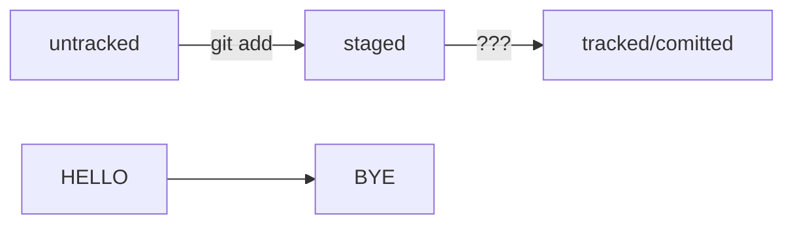

# Лабораторная работа №3
## Начало работы c Git
Выполнил ст. гр. 11405121

Зыкун Евгений
## Инициализируем репозиторий
### Сделать папку репозиторием - git init 
Чтобы Git начал отслеживать изменения в проекте, папку с файлами можно сделать Git-репозиторием. Для этого нужно переместится в нее и ввести команду.


### «Разгитить» папку, если что-то пошло не так, — rm -rf .git

Если вы случайно сделали Git-репозиторием не ту папку, её можно «разгитить». Для этого нужно
удалить скрытую подпапку .git.
```
$ cd <папка с репозиторием> # перешли в папку
$ rm -rf .git # удалили подпапку .git
```


### Проверить состояние репозитория — git status
После инициализации репозитория first-project запустите команду git status (от англ. status — «статус», «состояние») — она показывает текущее состояние репозитория.


### Подготовить файлы к сохранению — git add и git add --all


Важно помнить, что после каждого исправления файла нужно сохранять их с помощью коаманды git add или git add с флагом *--add*
## Делаем первый коммит
Сделать коммит можно командой git commit c ключом -m (от англ. message — «сообщение»),
который присваивает коммиту сообщение.


## Задание для самостоятельной работы


## Знакомство с GitHub

До этого момента вы использовали Git локально: сейчас проект first-project хранится только на вашем компьютере. Но одно из ключевых преимуществ Git — удобство командной работы над файлами. Чтобы поделиться репозиторием — например, с коллегами, — нужно завести его удалённую версию.

## Создаём удалённый репозиторий
В этой работе будем использовать уже существующий репозиторий на Github TPIOG2023. Устанавливаем утилиту xclip и копируем ключ
```
sudo apt install xclip
```


Генерируем SSH ключ


Копируем ключ

Потом заходим в гитхаб и вставляем туда скопированный ключ


Теперь, чтобы проверить что все получилось, переходим в терминал и вводимм команду
```
ssh -T git@github.com
```


Теперь нужно связать наш удаленный репозиторий с репозиторием на гитхаб
```
git remote --add

git pish -u origin main

```


Теперь переходим на гитхаб и видим какие появились изменения.


## Синхронизируем репозитории
```
git push
```


# Практическая работа No1


# Практическая работа No2
Попробуем использовать формат описания схем Mermaid. Принцип такой: вы описываете схему в специальном текстовом формате, а GitHub превращает описание в полноценную схему с блоками и стрелками.
```
modified +git add = staged
```

# Практическая работа №3. Нужно откатить изменения
Игнорирование файлов в Git
Чтобы Git игнорировал файлы и не пытаося добавить их в репозиторий, нужно создать файл .gitignore и записать в него названия игнорируемых файлов.

В этом уроке написано, как это сделать.
.gitignore - это обычный текстовый файл, который добавляют в корень репозитория и коммитят. В нём указывают все файлы, которые надо игнорировать (по одному имени на строку).
Правила для .gitignore

Если строка начинается с #, то это комментарий и он не учитывется
Простое название файла. Например все файлы .DS_Store:
.DS_Store
Пример файла .gitignore
build/
*.log
!examples/**/*.log
Игнорировать все файлы в каталоге build, игнорировать все файлы .log, не игнорировать *.log файлы в examples.
.gitignore и git status
Игнорируемые файлы не отображаются в выводе команды git status. Чтобы их увидеть надо ввести ключ --ignored: git status --ignored. В таком случае в выводе git status появится раздел Ignored files.


## Когда написаk ненужное

```
git restore <file>
```

## Когда уже накоммитил

```
git reset --hard <time travel!>
```

# Практическая работа №4. Исследуем историю коммитов

Нам понадобятся команды `git log` и `git diff`.


